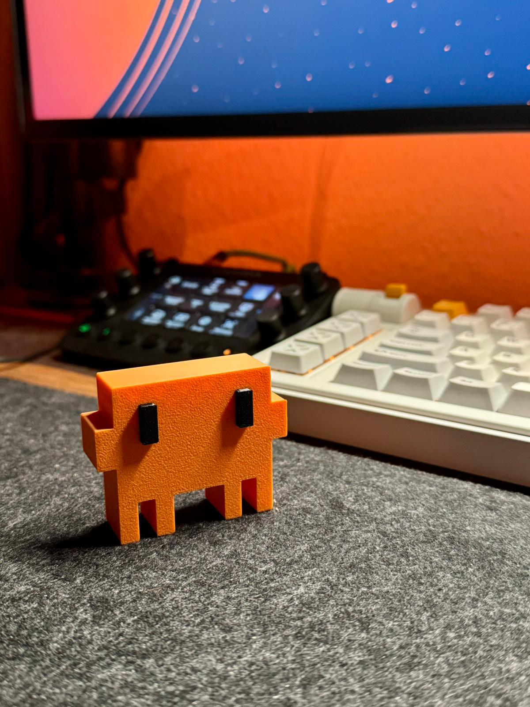

<p align="center">
  
</p>

<h1 align="center">Desk Clawd 🦀🚦</h1>

<p align="center">
  <b>An animated desk companion that shows your Claude Code status — LCD eyes + traffic light indicator, all on one ESP32-C3.</b>
</p>

<p align="center">
  <a href="#features">Features</a> ·
  <a href="#parts-list">Parts</a> ·
  <a href="#wiring">Wiring</a> ·
  <a href="#quick-start">Quick Start</a> ·
  <a href="#usage">Usage</a> ·
  <a href="#claude-code-integration">Hooks</a>
</p>

<p align="center">
  <b>~$8–10</b> ·
  <b>~1.5 hours</b> ·
  <b>Beginner</b>
</p>

---

> ⚠️ Fan project — not affiliated with, sponsored by, or endorsed by Anthropic. "Claude" is a trademark of Anthropic.

---

## Features

**🖥 Animated LCD eyes** — A 1.54" 240×240 color TFT display brings your desk buddy to life:

| Mode | What it does |
|------|-------------|
| 👀 Idle eyes | Pixel eyes that wiggle, blink, and squint |
| 💻 Claude Code screen | Terminal-style view showing session state |
| 🎨 Canvas | Draw from your phone's browser in real time |

**🚦 Traffic light status** — Three physical LEDs mirror your Claude Code session:

| State | Light | When |
|-------|-------|------|
| Idle | 🟢 **Green steady** | Waiting for your next prompt |
| Thinking | 🟡 **Yellow blinking** | Claude is generating a response |
| Running tools | 🔴 **Red blinking** | Tool execution (code, shell, file ops) |

**📱 Web dashboard** — No app, no internet, no cloud. Connect to the ESP32's built-in WiFi and control everything from any browser.

**🔌 Dual WiFi** — The ESP32 creates its own hotspot for direct phone access while simultaneously joining your home network so your PC can control it without switching WiFi.

---

## Parts list

| Part | Spec | ~Price |
|------|------|--------|
| ESP32-C3 Super Mini | Microcontroller with WiFi | $2.50 |
| ST7789 1.54" TFT | 240×240 SPI color display | $3.00 |
| Traffic light module | 3× LED (R/Y/G) with resistors | $1.00 |
| Jumper wires | 10–12× 8–10 cm Dupont wires | $0.80 |
| M2×6mm screws (×2) | Mount display bezel | $0.10 |
| Double-sided tape | Secure components inside case | $0.10 |
| USB-C cable | Power | — |
| 3D printed case | PLA or PETG, ~30g | $0.50 |

**Total: ~$8–10**

---

## Wiring

> ⚠️ Connect all VCC pins to **3.3V only** — never 5V.

### ST7789 Display

| Display pin | ESP32-C3 | Wire color |
|-------------|----------|------------|
| VCC | 3V3 | Red |
| GND | GND | Black |
| SDA (MOSI) | GPIO 10 | Orange |
| SCL (SCK) | GPIO 8 | Green |
| RST | GPIO 2 | Purple |
| DC | GPIO 1 | Blue |
| CS | GPIO 4 | White |
| BL | GPIO 3 | Yellow |

### Traffic light LEDs

| LED | ESP32-C3 | Wire color | Resistor |
|-----|----------|------------|----------|
| 🟢 Green | GPIO 5 | Green | 220Ω |
| 🟡 Yellow | GPIO 9 | Yellow | 220Ω |
| 🔴 Red | GPIO 20 | Red | 220Ω |
| ⚫ GND | GND | Black | — |

> **GND daisy-chain**: ESP32 GND → traffic light GND → display GND. One GND pin is enough.

---

## Quick start

### 1. Arduino IDE setup

Add board URL in **File → Preferences → Additional boards manager URLs**:
```
https://raw.githubusercontent.com/espressif/arduino-esp32/gh-pages/package_esp32_index.json
```

Then install via **Tools → Boards → Boards Manager**:
- **esp32** by Espressif Systems
- Libraries: **Adafruit GFX Library**, **Adafruit ST7735 and ST7789 Library**

### 2. Board settings

| Setting | Value |
|---------|-------|
| Board | ESP32C3 Dev Module |
| USB CDC On Boot | **Enabled** |
| CPU Frequency | 160 MHz |
| Upload Speed | 921600 |

### 3. WiFi (optional but recommended)

Copy `secrets.h.example` → `secrets.h`, fill in your home WiFi credentials. The ESP32 will connect to both its own hotspot AND your home network.

### 4. Upload

1. Open `firmware/desk-clawd/desk-clawd.ino` in Arduino IDE
2. Connect ESP32 via USB-C, select the port
3. Click **Upload**
4. Wait for `Hard resetting via RTS pin...`

---

## Usage

### Web dashboard

1. Power the ESP32
2. Connect to WiFi: **`Desk-Clawd`** · password: **`clawd1234`**
3. Open browser → **`http://192.168.4.1`**

From there: control eye animations, draw on screen, toggle backlight, open terminal view.

### Manual traffic light control

```bash
curl http://192.168.4.1/light?state=idle       # 🟢 green steady
curl http://192.168.4.1/light?state=thinking    # 🟡 yellow blink
curl http://192.168.4.1/light?state=running     # 🔴 red blink
curl http://192.168.4.1/light?state=G:on        # green on (direct)
curl http://192.168.4.1/light?state=Y:blink:700 # yellow blink 700ms
curl http://192.168.4.1/light?state=off         # all off
```

### Network access

| Network | Type | IP | Use for |
|---------|------|----|---------|
| `Desk-Clawd` | Hotspot (AP) | `192.168.4.1` | Phone / direct control |
| Your home WiFi | Client (STA) | DHCP (shown on screen) | PC on same LAN |

The ESP32 displays its LAN IP at boot. Run the detection script if the IP changes:

```bash
bash scripts/find-esp32.sh      # Linux / Git Bash
powershell scripts/find-esp32.ps1  # Windows PowerShell
```

---

## Claude Code integration

Add these hooks to `~/.claude/settings.json` to sync the traffic light with your session:

```json
{
  "hooks": {
    "UserPromptSubmit": [{
      "hooks": [{
        "type": "command",
        "command": "curl -s http://192.168.4.1/light?state=thinking"
      }]
    }],
    "PreToolUse": [{
      "matcher": "*",
      "hooks": [{
        "type": "command",
        "command": "curl -s http://192.168.4.1/light?state=running"
      }]
    }],
    "PostToolUse": [{
      "matcher": "*",
      "hooks": [{
        "type": "command",
        "command": "curl -s http://192.168.4.1/light?state=thinking"
      }]
    }],
    "Stop": [{
      "hooks": [{
        "type": "command",
        "command": "curl -s http://192.168.4.1/light?state=idle"
      }]
    }]
  }
}
```

Use `192.168.4.1` when on the hotspot, or the LAN IP shown on screen when both devices are on your home WiFi.

> Also see `claude-hooks.example.json` for a ready-to-merge config.

---

## 3D models

### Electronics case

`models/case/` contains the main enclosure (body + back plate):

| File | Description |
|------|-------------|
| `clawd_mochi_v1.stl` | Main case body |

**Print settings:** PLA/PETG · 0.15–0.20mm layer · 15% gyroid infill · Supports for display window overhang · Print face-down.

### Clawd figure

`models/clawd-figure/` has standalone mascot models (no electronics):

| File | Description |
|------|-------------|
| `clawd_3D_no_AMS.stl` | Standard Clawd figure |
| `clawd_3D_squished_eyes_no_AMS.stl` | Squished eyes variant |

---

## Assembly tips

1. Print case + back plate — test-fit the display before gluing
2. Thread wires through the back plate slot
3. Secure ESP32 with double-sided tape inside the back plate
4. Mount display with M2×6mm screws through bezel holes
5. Secure traffic light module in its housing
6. Route USB-C cable through back slot, snap back plate on

---

## Customisation

### Eye appearance (in `desk-clawd.ino`)

```cpp
#define EYE_W   30    // eye width
#define EYE_H   60    // eye height
#define EYE_GAP 120   // gap between eyes
#define EYE_OX  0     // horizontal offset
#define EYE_OY  40    // vertical offset upward
```

### Blink speed

Custom blink interval via URL — handy for testing:

```bash
curl http://192.168.4.1/light?state=Y:blink:700
```

### Logo reveal timing

```cpp
delay(1500);         // hold after reveal
delay(speedMs(8));   // stroke draw speed
```

---

## Project structure

```
desk-clawd/
├── firmware/
│   └── desk-clawd/
│       └── desk-clawd.ino      # Main firmware
├── models/
│   ├── case/                   # 3D-printable case
│   └── clawd-figure/           # Standalone mascot figure
├── pics/                       # Photos and renders
├── scripts/
│   ├── find-esp32.sh           # IP auto-detection (bash)
│   └── find-esp32.ps1          # IP auto-detection (PowerShell)
├── secrets.h                   # WiFi credentials (gitignored)
├── secrets.h.example           # Template
├── claude-hooks.example.json   # Claude Code hooks reference
├── LICENSE
└── README.md
```

---

## License

**Code** — MIT License (see [LICENSE](LICENSE))

**3D models & media** — CC BY-NC-SA 4.0

---

<p align="center">
  
</p>
