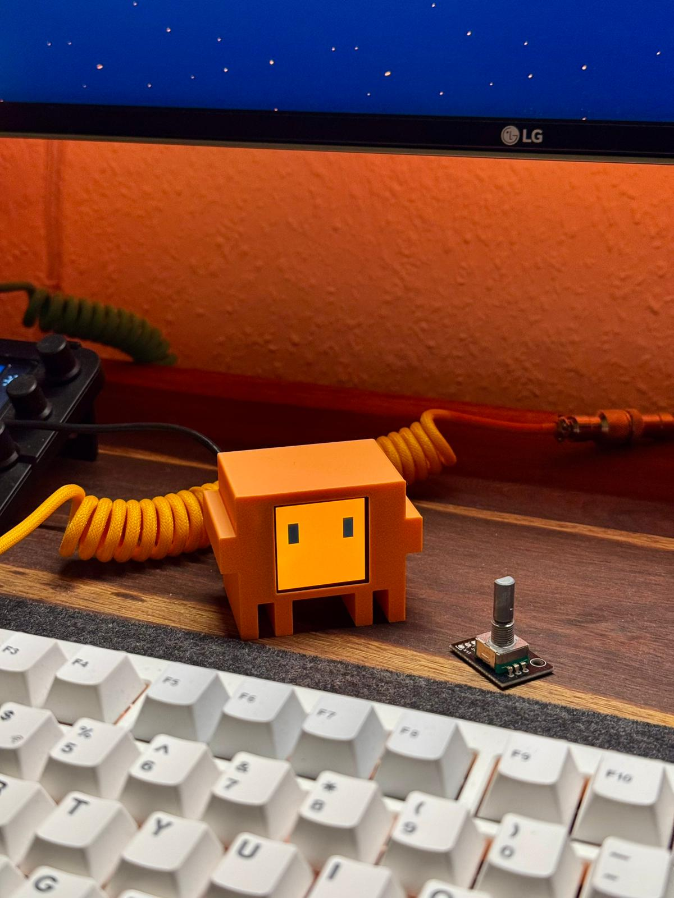

<p align="center">
  
</p>

<h1 align="center">Desk Clawd 🦀🚦</h1>

<p align="center">
  <b>A physical Claude Code desk companion — animated LCD eyes + real-time traffic light status indicator, all on one ESP32-C3.</b>
</p>

<p align="center">
  <a href="#features">Features</a> ·
  <a href="#parts-list">Parts</a> ·
  <a href="#wiring">Wiring</a> ·
  <a href="#software-setup">Software</a> ·
  <a href="#claude-code-integration">Hooks</a> ·
  <a href="#3d-models">3D Models</a>
</p>

<p align="center">
  <b>Cost: ~$8–10</b> ·
  <b>Build time: ~1.5 hours</b> ·
  <b>Skill: Beginner</b>
</p>

---

> ⚠️ This is an independent fan project. It is not affiliated with, sponsored by, or endorsed by Anthropic. "Claude" and "Clawd" are trademarks of Anthropic.

---

<p align="center">
  
</p>

## Features

**🖥 Animated LCD display** — A 1.54" color TFT shows the Clawd mascot with lively expressions:
- Pixel eyes that wiggle, blink, and squint
- "Claude Code" view with interactive terminal
- Canvas for drawing from your phone in real time

**🚦 Traffic light status indicator** — Three physical LEDs reflect your Claude Code session:

| State | Light | When |
|-------|-------|------|
| Idle | 🟢 **Green solid** | Waiting for your input |
| Thinking | 🟡 **Yellow blink** | Claude processing your prompt |
| Running tools | 🔴 **Red blink** | Tool execution (code, shell, etc.) |

**📱 Web-based controller** — No app, no internet, no cloud. Connect to the ESP32's WiFi and open a browser. Control everything from your phone or PC.

**🔌 Dual WiFi** — The ESP32 creates its own hotspot for direct phone control, while simultaneously connecting to your home network so your PC can control it without switching WiFi.

---

## Parts list

| Part | Spec | ~Price |
|------|------|--------|
| ESP32-C3 Super Mini | Microcontroller with WiFi | $2.50 |
| ST7789 1.54" TFT | 240×240 SPI color display | $3.00 |
| Traffic light module | 3× LED (R/Y/G) with resistors, or 3× 5mm LED + 220Ω resistors | $1.00 |
| Jumper wires | 10–12× 8–10 cm Dupont wires | $0.80 |
| M2×6mm screws (×2) | Mount display bezel | $0.10 |
| Double-sided tape | Secure components inside case | $0.10 |
| USB-C cable | Power | — |
| 3D printed case | PLA or PETG, ~30g | $0.50 |

**Total: ~$8–10**

---

## Wiring

> ⚠️ Connect all VCC pins to **3.3V only** — never 5V.

### ST7789 Display

| Display | ESP32-C3 | Wire color |
|---------|----------|------------|
| VCC | 3V3 | Red |
| GND | GND | Black |
| SDA (MOSI) | GPIO 10 | Orange |
| SCL (SCK) | GPIO 8 | Green |
| RST | GPIO 2 | Purple |
| DC | GPIO 1 | Blue |
| CS | GPIO 4 | White |
| BL | GPIO 3 | Yellow |

### Traffic light LEDs

| LED | ESP32-C3 | Wire color | Resistor |
|-----|----------|------------|----------|
| 🟢 Green | GPIO 5 | Green | 220Ω |
| 🟡 Yellow | GPIO 9 | Yellow | 220Ω |
| 🔴 Red | GPIO 20 | Red | 220Ω |
| ⚫ GND | GND | Black | — |

> **GND wiring**: Daisy-chain is fine — ESP32 GND → traffic light GND → display GND.

---

## Software setup

### Arduino IDE

1. Download [Arduino IDE 2.x](https://www.arduino.cc/en/software)
2. **File → Preferences** → Add to "Additional boards manager URLs":
   ```
   https://raw.githubusercontent.com/espressif/arduino-esp32/gh-pages/package_esp32_index.json
   ```
3. **Tools → Board → Boards Manager** → Search `esp32` → Install **"esp32 by Espressif Systems"**
4. **Tools → Library Manager** → Install:
   - `Adafruit GFX Library`
   - `Adafruit ST7735 and ST7789 Library`

### Board settings

| Setting | Value |
|---------|-------|
| Board | ESP32C3 Dev Module |
| USB CDC On Boot | **Enabled** |
| CPU Frequency | 160 MHz |
| Upload Speed | 921600 |

### Home WiFi (optional but recommended)

1. Copy `secrets.h.example` → `secrets.h`
2. Fill in your WiFi name and password
3. The ESP32 will connect to your network so your PC can reach it

### Upload

1. Open `firmware/desk-clawd/desk-clawd.ino` in Arduino IDE
2. Connect ESP32 via USB-C
3. Select port under **Tools → Port**
4. Click **Upload**
5. Wait for `Hard resetting via RTS pin...`

---

## Usage

### Web controller

1. Power the ESP32
2. Connect to WiFi: **`Desk-Clawd`** · password: **`clawd1234`**
3. Open browser → **`http://192.168.4.1`**

From there you can trigger eye animations, draw on the display, open the terminal, and toggle the backlight.

### Manual traffic light control

```bash
curl http://192.168.4.1/light?state=idle       # 🟢 green on
curl http://192.168.4.1/light?state=thinking    # 🟡 yellow blink
curl http://192.168.4.1/light?state=running     # 🔴 red blink
curl http://192.168.4.1/light?state=G:on        # green on (direct)
curl http://192.168.4.1/light?state=Y:blink:700 # yellow blink 700ms
curl http://192.168.4.1/light?state=off         # all off
```

### Dual-network IP

| Network | Type | IP | Use for |
|---------|------|----|---------|
| `Desk-Clawd` | Hotspot (AP) | `192.168.4.1` | Phone / direct control |
| Your home WiFi | Client (STA) | DHCP (shown on screen) | PC on same LAN |

The ESP32 displays its LAN IP at boot (e.g. `IP: 10.0.0.42`). Use this for curl from your PC.

### IP auto-detection

If the LAN IP changes, run:

```bash
bash scripts/find-esp32.sh
```

It scans your network, finds the ESP32, and auto-updates your Claude Code hooks config.

---

## Claude Code integration

The traffic light follows your Claude Code session automatically via hooks — no background process needed.

Merge this into `~/.claude/settings.json` (or copy `claude-hooks.example.json`):

```json
{
  "hooks": {
    "UserPromptSubmit": [{
      "hooks": [{
        "type": "command",
        "command": "curl -s http://192.168.4.1/light?state=thinking"
      }]
    }],
    "PreToolUse": [{
      "matcher": "*",
      "hooks": [{
        "type": "command",
        "command": "curl -s http://192.168.4.1/light?state=running"
      }]
    }],
    "PostToolUse": [{
      "matcher": "*",
      "hooks": [{
        "type": "command",
        "command": "curl -s http://192.168.4.1/light?state=thinking"
      }]
    }],
    "Stop": [{
      "hooks": [{
        "type": "command",
        "command": "curl -s http://192.168.4.1/light?state=idle"
      }]
    }]
  }
}
```

Use `192.168.4.1` when your PC is on the `Desk-Clawd` hotspot, or the LAN IP shown on the screen when both devices are on your home WiFi.

---

## 3D models

### Electronics case

The main case (body + back plate) is in `models/case/`:

| File | Description |
|------|-------------|
| `clawd_mochi_v1.stl` | Body + back plate (rename to `desk-clawd` for branding) |

**Print settings:**

| Setting | Value |
|---------|-------|
| Material | PLA or PETG |
| Layer height | 0.15–0.20 mm |
| Infill | 15% gyroid |
| Supports | Yes — display window overhang |
| Orientation | Face-down, flat back on plate |

### Clawd figure

Standalone 3D-printable Clawd mascot (no electronics) in `models/clawd-figure/`:

| File | Description |
|------|-------------|
| `clawd_3D_no_AMS.stl` | Original Clawd figure |
| `clawd_3D_squished_eyes_no_AMS.stl` | Squished eyes variant |

---

## Assembly

1. Print case (body + back) — test-fit display before gluing
2. Thread all wires through the back plate slot
3. Secure ESP32 with double-sided tape inside the back plate
4. Mount display with M2×6mm screws through bezel holes
5. Secure traffic light module in its housing
6. Route USB-C cable through back slot, snap back on

---

## Customisation

### Eye appearance

In `desk-clawd.ino`:

```cpp
#define EYE_W   30    // eye width
#define EYE_H   60    // eye height
#define EYE_GAP 120   // gap between eyes
#define EYE_OX  0     // horizontal offset
#define EYE_OY  40    // vertical offset upward
```

### Blink interval

Default blink is 250ms. Customise via URL:

```bash
curl http://192.168.4.1/light?state=Y:blink:700
```

### Logo animation

```cpp
// Duration the logo holds after reveal
delay(1500);
// Stroke-by-stroke draw speed
delay(speedMs(8));
```

---

## Project structure

```
desk-clawd/
├── firmware/
│   └── desk-clawd/
│       └── desk-clawd.ino      # Main firmware
├── models/
│   ├── case/                   # Electronics case (3D print)
│   └── clawd-figure/           # Clawd mascot figure
├── pics/                       # Photos and logos
├── scripts/
│   ├── find-esp32.sh           # IP auto-detection (bash)
│   └── find-esp32.ps1          # IP auto-detection (PowerShell)
├── secrets.h                   # Your WiFi credentials (gitignored)
├── secrets.h.example           # Template for others
├── claude-hooks.example.json   # Claude Code hooks config
├── LICENSE
└── README.md
```

---

## License

Code is licensed under the **MIT License** — see [LICENSE](LICENSE).

3D models and media assets are licensed under **CC BY-NC-SA 4.0**.

---

<p align="center">
  Built with ❤️ by the Claude Code community
</p>
