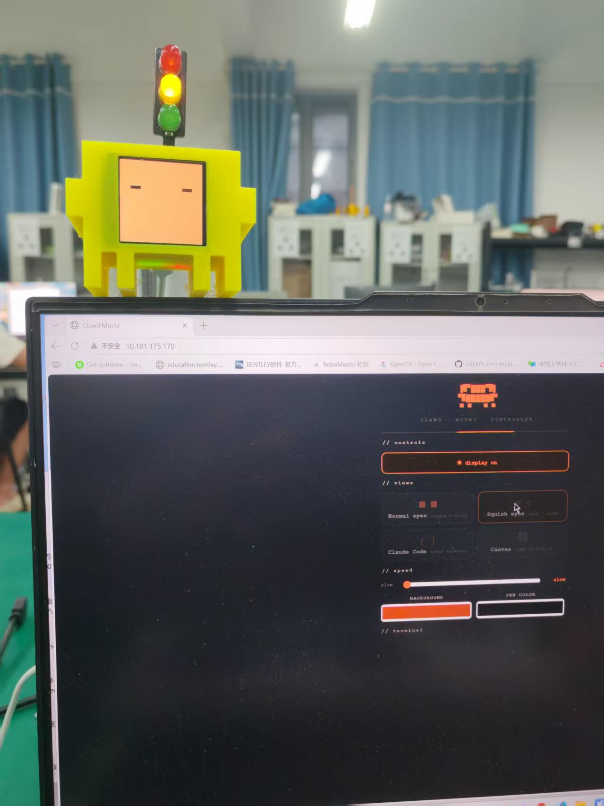
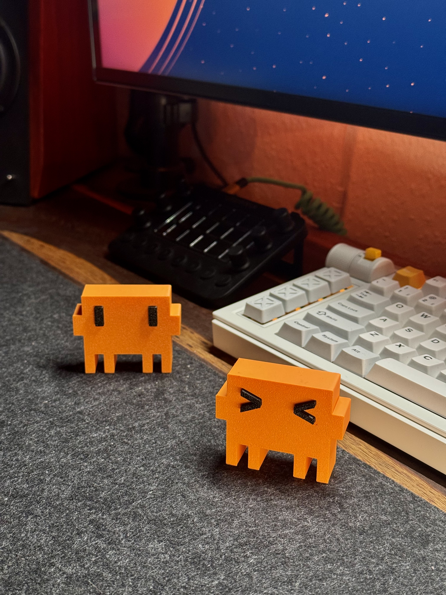

<p align="right">
  <a href="README.md">🇬🇧 English</a>
</p>

<p align="center">
  
</p>

<h1 align="center">Desk Clawd 🦀🚦</h1>

<p align="center">
  <b>一个会动的桌面小伙伴 —— LCD 动画眼睛 + 红绿灯状态指示器，全部集成在一片 ESP32-C3 上。</b>
</p>

<p align="center">
  <a href="#功能特点">功能特点</a> ·
  <a href="#零件清单">零件清单</a> ·
  <a href="#接线">接线</a> ·
  <a href="#快速开始">快速开始</a> ·
  <a href="#使用方式">使用方式</a> ·
  <a href="#claude-code-集成">Claude Code 集成</a>
</p>

<p align="center">
  <b>~¥60–70</b> ·
  <b>~1.5 小时</b> ·
  <b>新手友好</b>
</p>

---

> ⚠️ 粉丝自制项目，与 Anthropic 无任何关联。"Claude" 是 Anthropic 的商标。

---

## 功能特点

**🖥 动画 LCD 眼睛** — 1.54 寸 240×240 彩色 TFT 屏幕，让你的桌面伙伴活起来：

| 模式 | 说明 |
|------|------|
| 👀 待机眼睛 | 像素眼睛会转动、眨眼、眯眼 |
| 💻 Claude Code 界面 | 终端风格显示，展示会话状态 |
| 🎨 画板 | 在手机浏览器上实时涂鸦 |

**🚦 红绿灯状态灯** — 三颗 LED 实时反映 Claude Code 的运行状态：

| 状态 | 灯光 | 什么时候 |
|------|------|---------|
| 空闲 | 🟢 **绿灯常亮** | 等待你输入提示词 |
| 思考中 | 🟡 **黄灯闪烁** | Claude 正在生成回答 |
| 运行工具 | 🔴 **红灯闪烁** | 执行代码、命令、文件操作等 |

**📱 网页控制面板** — 无需安装 App，无需联网，无需云服务。连上 ESP32 自带的 WiFi，打开浏览器就能控制一切。

**🔌 双 WiFi 模式** — ESP32 同时开启热点（手机直连）和连接家庭网络（电脑控制），互不干扰。

---

## 零件清单

| 零件 | 规格 | 参考价 |
|------|------|--------|
| ESP32-C3 Super Mini | 带 WiFi 的微控制器 | ¥18 |
| ST7789 1.54" TFT 屏 | 240×240 SPI 彩色屏幕 | ¥22 |
| 红绿灯模块 | 3 颗 LED（红/黄/绿）带电阻 | ¥7 |
| 杜邦线 | 10–12 根，8–10 cm | ¥6 |
| M2×6mm 螺丝（×2） | 固定屏幕边框 | ¥1 |
| 双面胶 | 固定内部元件 | ¥1 |
| USB-C 线 | 供电 | — |
| 3D 打印外壳 | PLA 或 PETG，约 30g | ¥15 |

**合计：约 ¥60–70**

---

## 接线

> ⚠️ 所有 VCC 引脚必须接 **3.3V** — 切勿接 5V。

### ST7789 显示屏

| 屏幕引脚 | ESP32-C3 | 线色 |
|----------|----------|------|
| VCC | 3V3 | 红 |
| GND | GND | 黑 |
| SDA（MOSI） | GPIO 10 | 橙 |
| SCL（SCK） | GPIO 8 | 绿 |
| RST | GPIO 2 | 紫 |
| DC | GPIO 1 | 蓝 |
| CS | GPIO 4 | 白 |
| BL | GPIO 3 | 黄 |

### 红绿灯 LED

| LED | ESP32-C3 | 线色 | 电阻 |
|-----|----------|------|------|
| 🟢 绿灯 | GPIO 5 | 绿 | 220Ω |
| 🟡 黄灯 | GPIO 9 | 黄 | 220Ω |
| 🔴 红灯 | GPIO 20 | 红 | 220Ω |
| ⚫ GND | GND | 黑 | — |

> **GND 串联**：ESP32 GND → 红绿灯 GND → 屏幕 GND。一个 GND 引脚就够用。

---

## 快速开始

### 1. Arduino IDE 配置

添加开发板地址：**文件 → 偏好设置 → 附加开发板管理器网址**：
```
https://raw.githubusercontent.com/espressif/arduino-esp32/gh-pages/package_esp32_index.json
```

然后在 **工具 → 开发板 → 开发板管理器** 中安装：
- **esp32** by Espressif Systems
- 库文件：**Adafruit GFX Library**、**Adafruit ST7735 and ST7789 Library**

### 2. 开发板设置

| 设置项 | 值 |
|--------|-----|
| 开发板 | ESP32C3 Dev Module |
| USB CDC On Boot | **启用** |
| CPU 频率 | 160 MHz |
| 上传速率 | 921600 |

### 3. WiFi（推荐配置）

复制 `secrets.h.example` → `secrets.h`，填入家庭 WiFi 名称和密码。ESP32 会同时开启热点并连接你的家庭网络。

### 4. 上传固件

1. 用 Arduino IDE 打开 `firmware/desk-clawd/desk-clawd.ino`
2. 通过 USB-C 连接 ESP32，选择对应端口
3. 点击 **上传**
4. 等待提示 `Hard resetting via RTS pin...`

---

## 使用方式

### 网页控制面板

1. 给 ESP32 通电
2. 连接 WiFi：**`Desk-Clawd`** · 密码：**`clawd1234`**
3. 打开浏览器 → **`http://192.168.4.1`**

在这个页面可以：控制眼睛动画、屏幕涂鸦、开关背光、打开终端视图。

### 手动控制红绿灯

```bash
curl http://192.168.4.1/light?state=idle       # 🟢 绿灯常亮
curl http://192.168.4.1/light?state=thinking    # 🟡 黄灯闪烁
curl http://192.168.4.1/light?state=running     # 🔴 红灯闪烁
curl http://192.168.4.1/light?state=G:on        # 绿灯直接亮
curl http://192.168.4.1/light?state=Y:blink:700 # 黄灯 700ms 闪烁
curl http://192.168.4.1/light?state=off         # 全部熄灭
```

### 网络访问

| 网络 | 类型 | IP 地址 | 用途 |
|------|------|---------|------|
| `Desk-Clawd` | 热点（AP） | `192.168.4.1` | 手机直连控制 |
| 你的家庭 WiFi | 客户端（STA） | DHCP（屏幕显示） | 同局域网电脑控制 |

ESP32 启动时会在屏幕上显示局域网 IP。如果 IP 变了，运行自动检测脚本：

```bash
bash scripts/find-esp32.sh          # Linux / Git Bash
powershell scripts/find-esp32.ps1   # Windows PowerShell
```

---

## Claude Code 集成

在 `~/.claude/settings.json` 中添加以下 hooks，让红绿灯跟随你的 Claude Code 会话：

```json
{
  "hooks": {
    "UserPromptSubmit": [{
      "hooks": [{
        "type": "command",
        "command": "curl -s http://192.168.4.1/light?state=thinking"
      }]
    }],
    "PreToolUse": [{
      "matcher": "*",
      "hooks": [{
        "type": "command",
        "command": "curl -s http://192.168.4.1/light?state=running"
      }]
    }],
    "PostToolUse": [{
      "matcher": "*",
      "hooks": [{
        "type": "command",
        "command": "curl -s http://192.168.4.1/light?state=thinking"
      }]
    }],
    "Stop": [{
      "hooks": [{
        "type": "command",
        "command": "curl -s http://192.168.4.1/light?state=idle"
      }]
    }]
  }
}
```

连热点时用 `192.168.4.1`，都在家庭网络时用屏幕上显示的局域网 IP。

> 参考 `claude-hooks.example.json` 获取可直接合并的配置。

---

## 3D 模型

### 外壳

`models/case/` 内含主体外壳（机身 + 背板）：

| 文件 | 说明 |
|------|------|
| `clawd_mochi_v1.stl` | 主体外壳 |

**打印参数：** PLA/PETG · 层高 0.15–0.20mm · 填充 15% gyroid · 屏幕窗口悬空处需支撑 · 正面朝下打印。

### Clawd 玩偶

`models/clawd-figure/` 包含独立 Clawd 模型（不含电子元件）：

| 文件 | 说明 |
|------|------|
| `clawd_3D_no_AMS.stl` | 标准 Clawd |
| `clawd_3D_squished_eyes_no_AMS.stl` | 压扁眼睛表情版 |

---

## 组装建议

1. 先打印外壳 + 背板 — 粘胶前先试放屏幕确认贴合
2. 所有线从背板走线槽穿过
3. 用双面胶将 ESP32 固定在背板内侧
4. 用 M2×6mm 螺丝通过边框孔固定屏幕
5. 将红绿灯模块固定到对应位置
6. USB-C 线从背板槽口穿出，扣上背板

---

## 自定义

### 眼睛外观（修改 `desk-clawd.ino`）

```cpp
#define EYE_W   30    // 眼睛宽度
#define EYE_H   60    // 眼睛高度
#define EYE_GAP 120   // 双眼间距
#define EYE_OX  0     // 水平偏移
#define EYE_OY  40    // 垂直偏移（向上）
```

### 闪烁速度

通过 URL 自定义闪烁间隔，方便测试：

```bash
curl http://192.168.4.1/light?state=Y:blink:700
```

### Logo 动画速度

```cpp
delay(1500);         // 展示后停留时间
delay(speedMs(8));   // 笔画绘制速度
```

---

## 项目结构

```
desk-clawd/
├── firmware/
│   └── desk-clawd/
│       └── desk-clawd.ino      # 主固件
├── models/
│   ├── case/                   # 3D 打印外壳
│   └── clawd-figure/           # 独立 Clawd 玩偶
├── pics/                       # 照片与渲染图
├── scripts/
│   ├── find-esp32.sh           # IP 自动检测（bash）
│   └── find-esp32.ps1          # IP 自动检测（PowerShell）
├── secrets.h                   # WiFi 密码（已 gitignore）
├── secrets.h.example           # 配置模板
├── claude-hooks.example.json   # Claude Code hooks 配置参考
├── LICENSE
├── README.md                   # 英文版说明
└── README.zh.md                # 中文版说明
```

---

## 许可证

**代码** — MIT 协议（详见 [LICENSE](LICENSE)）

**3D 模型与图片素材** — CC BY-NC-SA 4.0

---

<p align="center">
  
</p>
